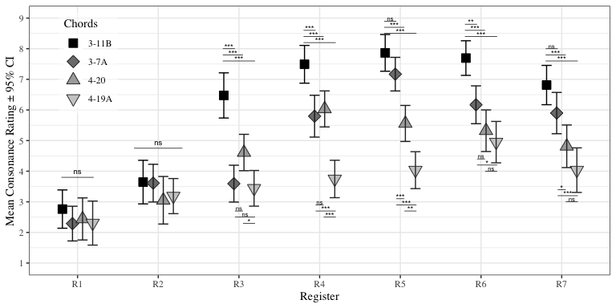

<!-- README.md is generated from README.Rmd. Please edit that file -->

# Register and consonance

<!-- badges: start -->
<!-- badges: end -->

This repository contains data and analyses concerning study titled
“Register Impacts Perceptual Consonance through Roughness and Sharpness”
by Tuomas Eerola and Imre Lahdelma (in review).

## Background

<div class="figure">


<p class="caption">
Panel A: 7 stimulus registers overlaid on an idealised distribution of
orchestral instrument ranges (from Huron, 2001, p. 8). Panel B:
Calculated roughness and sharpness values for different chords across
the stimulus registers.
</p>

</div>

## Stimuli

| MIDI        | Quadrant              | Forte | Rating | Label                        |
|:------------|:----------------------|:------|-------:|:-----------------------------|
| 54 58 61 66 | Low Rough. High Fam.  | 3-11B | 10.000 | Major triad                  |
| 53 60 62 65 | Low Rough. Low Fam.   | 3-7A  |  8.166 | Power chord + M6             |
| 56 57 61 64 | High Rough. High Fam. | 4-20  |  6.033 | Major 7th 3rd inv.           |
| 57 58 61 65 | High Rough. Low Fam.  | 4-19A |  2.194 | Minor-Major seventh 3rd inv. |

Stimulus details.

## Load and preprocess the data

### Summarise consonance ratings

<div class="figure">


<p class="caption">
Consonance ratings across Chord and Register.
</p>

</div>

### Linear mixed model

<caption>
(\#tab:LMM)
</caption>

<div custom-style="Table Caption">

*Linear Mixed Model analysis results for the consonance ratings for two
Factors.*

</div>

| Term             | *β̂*   | 95% CI           | *t*   | *d**f*   | *p*       |
|:-----------------|:------|:-----------------|:------|:---------|:----------|
| Intercept        | 2.92  | \[2.22, 3.61\]   | 8.21  | 1,278.58 | &lt; .001 |
| Chord            | -0.14 | \[-0.38, 0.10\]  | -1.15 | 1,590.00 | .248      |
| Register         | 0.96  | \[0.81, 1.10\]   | 12.72 | 1,590.00 | &lt; .001 |
| Chord × Register | -0.16 | \[-0.21, -0.10\] | -5.72 | 1,590.00 | &lt; .001 |

### Post-hoc analyses of Register and Chord

``` r
source('figure3.R')
```

<div class="figure">


<p class="caption">
Consonance ratings across Register and Chord with posthoc analyses.
</p>

</div>

### Regression with the means

<div class="figure">


<p class="caption">
Cubic model fit to (A) mean consonance ratings and (B) means across the
chords.
</p>

</div>

### Regression with the acoustic variables

|  estimate | p.value | statistic |   n |  gp | Method  |
|----------:|--------:|----------:|----:|----:|:--------|
| -0.854541 |       0 | -8.226488 |  28 |   1 | pearson |

Semi partial correlation between Consonance and Roughness (Sharpness
partialled out)

|   estimate |   p.value | statistic |   n |  gp | Method  |
|-----------:|----------:|----------:|----:|----:|:--------|
| -0.2308706 | 0.2466155 | -1.186404 |  28 |   1 | pearson |

Semi partial correlation between Consonance and Sharpness (Roughness
partialled out)

<caption>
(\#tab:regression\_acoustic)
</caption>

<div custom-style="Table Caption">

*A regression table with the two acoustic predictors.*

</div>

| Predictor | *b*   | 95% CI               | *t*(25) | *p*       |
|:----------|:------|:---------------------|:--------|:----------|
| Intercept | 9.30  | \[7.31, 11.29\]      | 9.64    | &lt; .001 |
| Roughness | -7.51 | \[ − 9.20,  − 5.83\] | -9.18   | &lt; .001 |
| Sharpness | -2.20 | \[ − 4.03,  − 0.37\] | -2.48   | .020      |

## Auxiliary analyses

| Familiarity | Roughness | emmean |   SE |     df | lower.CL | upper.CL |
|:------------|:----------|-------:|-----:|-------:|---------:|---------:|
| FHigh       | RHigh     |   4.55 | 0.18 | 187.42 |     4.20 |     4.89 |
| FLow        | RHigh     |   3.67 | 0.18 | 187.42 |     3.32 |     4.02 |
| FHigh       | RLow      |   6.11 | 0.18 | 187.42 |     5.76 |     6.45 |
| FLow        | RLow      |   4.93 | 0.18 | 187.42 |     4.59 |     5.28 |

Musical Expertise

| Var1         | Freq |
|:-------------|-----:|
| Non-musician |   43 |
| Musician     |   16 |

|                                                                 | Estimate | Std. Error | t value |
|:----------------------------------------------------------------|---------:|-----------:|--------:|
| (Intercept)                                                     |     2.82 |       0.41 |    6.80 |
| as.numeric(Chord)                                               |    -0.12 |       0.14 |   -0.84 |
| as.numeric(Register)                                            |     0.90 |       0.09 |   10.26 |
| MusicalExpertiseMusician                                        |     0.35 |       0.80 |    0.44 |
| as.numeric(Chord):as.numeric(Register)                          |    -0.13 |       0.03 |   -4.09 |
| as.numeric(Chord):MusicalExpertiseMusician                      |    -0.08 |       0.27 |   -0.29 |
| as.numeric(Register):MusicalExpertiseMusician                   |     0.21 |       0.17 |    1.25 |
| as.numeric(Chord):as.numeric(Register):MusicalExpertiseMusician |    -0.10 |       0.06 |   -1.56 |

| MusicalExpertise | Register | emmean |   SE |     df | lower.CL | upper.CL |
|:-----------------|:---------|-------:|-----:|-------:|---------:|---------:|
| Non-musician     | -3       |   2.47 | 0.23 | 254.66 |     2.02 |     2.91 |
| Musician         | -3       |   2.41 | 0.37 | 254.66 |     1.68 |     3.14 |
| Non-musician     | -2       |   3.40 | 0.23 | 254.66 |     2.96 |     3.85 |
| Musician         | -2       |   3.30 | 0.37 | 254.66 |     2.57 |     4.03 |
| Non-musician     | -1       |   4.46 | 0.23 | 254.66 |     4.01 |     4.90 |
| Musician         | -1       |   4.72 | 0.37 | 254.66 |     3.99 |     5.45 |
| Non-musician     | 0        |   5.65 | 0.23 | 254.66 |     5.20 |     6.09 |
| Musician         | 0        |   6.09 | 0.37 | 254.66 |     5.36 |     6.82 |
| Non-musician     | 1        |   6.13 | 0.23 | 254.66 |     5.69 |     6.58 |
| Musician         | 1        |   6.22 | 0.37 | 254.66 |     5.49 |     6.95 |
| Non-musician     | 2        |   6.08 | 0.23 | 254.66 |     5.64 |     6.53 |
| Musician         | 2        |   5.91 | 0.37 | 254.66 |     5.18 |     6.64 |
| Non-musician     | 3        |   5.45 | 0.23 | 254.66 |     5.01 |     5.90 |
| Musician         | 3        |   5.22 | 0.37 | 254.66 |     4.49 |     5.95 |

| MusicalExpertise | Chord | emmean |   SE |     df | lower.CL | upper.CL |
|:-----------------|:------|-------:|-----:|-------:|---------:|---------:|
| Non-musician     | 3-11B |   5.85 | 0.19 | 141.09 |     5.47 |     6.23 |
| Musician         | 3-11B |   6.79 | 0.32 | 141.09 |     6.17 |     7.42 |
| Non-musician     | 3-7A  |   4.93 | 0.19 | 141.09 |     4.55 |     5.31 |
| Musician         | 3-7A  |   4.94 | 0.32 | 141.09 |     4.31 |     5.56 |
| Non-musician     | 4-20  |   4.64 | 0.19 | 141.09 |     4.26 |     5.02 |
| Musician         | 4-20  |   4.29 | 0.32 | 141.09 |     3.67 |     4.92 |
| Non-musician     | 4-19A |   3.80 | 0.19 | 141.09 |     3.42 |     4.18 |
| Musician         | 4-19A |   3.32 | 0.32 | 141.09 |     2.69 |     3.95 |
