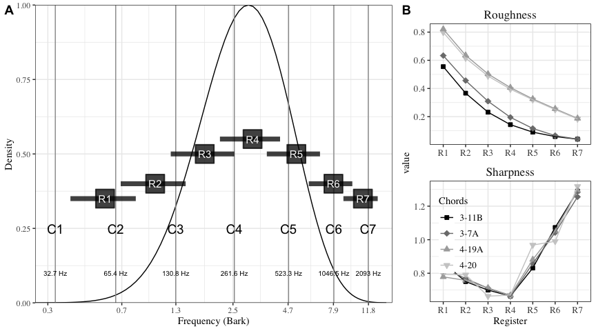
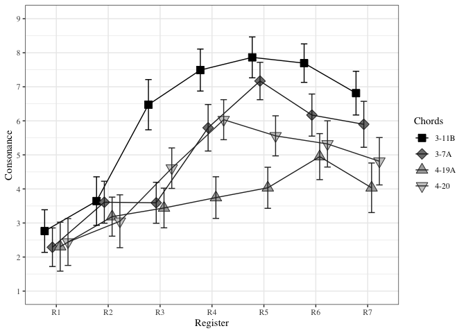
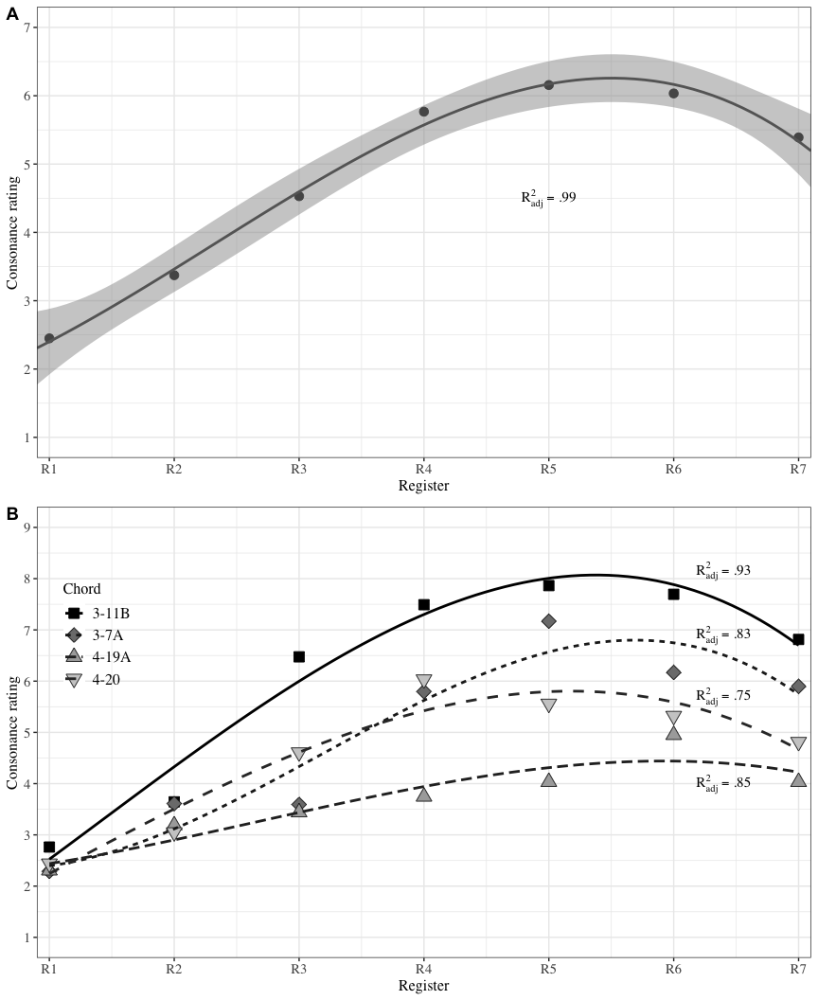

<!-- README.md is generated from README.Rmd. Please edit that file -->

# Register and consonance

<!-- badges: start -->
<!-- badges: end -->

This repository contains data and analysis concerning study titled
“Register Impacts Perceptual Consonance through Roughness and Sharpness”
by XXXX XXXXX XXXXXX XXXXX.

## Background

Panel A: 7 stimulus registers overlaid on an idealised distribution of
orchestral instrument ranges (from Huron, 2001, p.8). Panel B:
Calculated roughness and sharpness values for different chords across
the stimulus registers.

## Stimuli

| MIDI        | Quadrant              | Forte | Rating | Label                        |
|:------------|:----------------------|:------|-------:|:-----------------------------|
| 54 58 61 66 | Low Rough. High Fam.  | 3-11B | 10.000 | Major triad                  |
| 53 60 62 65 | Low Rough. Low Fam.   | 3-7A  |  8.166 | Power chord + M6             |
| 56 57 61 64 | High Rough. High Fam. | 4-20  |  6.033 | Major 7th 3rd inv.           |
| 57 58 61 65 | High Rough. Low Fam.  | 4-19A |  2.194 | Minor-Major seventh 3rd inv. |

Stimulus details.

## Load and preprocess the data

### Summarise consonance ratings

### Linear mixed model

<caption>
(\#tab:LMM\_table)
</caption>

*Linear Mixed Model analysis results for the consonance ratings for
three Factors.*

| term                         | *β̂*   | 95% CI           | *t*   | *d**f*   | *p*       |
|:-----------------------------|:------|:-----------------|:------|:---------|:----------|
| Chord                        | -0.14 | \[-0.41, 0.14\]  | -0.99 | 1,587.00 | .323      |
| Register                     | 0.84  | \[0.67, 1.01\]   | 9.82  | 1,587.00 | &lt; .001 |
| Expertise                    | -1.21 | \[-2.83, 0.41\]  | -1.46 | 1,262.02 | .144      |
| Chord × Register             | -0.13 | \[-0.19, -0.07\] | -4.24 | 1,587.00 | &lt; .001 |
| Chord × Expertise            | -0.01 | \[-0.58, 0.55\]  | -0.05 | 1,587.00 | .958      |
| Register × Expertise         | 0.49  | \[0.14, 0.83\]   | 2.78  | 1,587.00 | .005      |
| Chord × Register × Expertise | -0.10 | \[-0.23, 0.02\]  | -1.62 | 1,587.00 | .105      |

### Regression with the means

Cubic model fit to (A) mean consonance ratings and (B) means across the
chords.

### Regression with the acoustic variables

    #> Loading required package: MASS
    #> 
    #> Attaching package: 'MASS'
    #> The following object is masked from 'package:dplyr':
    #> 
    #>     select

|  estimate | p.value | statistic |   n |  gp | Method  |
|----------:|--------:|----------:|----:|----:|:--------|
| -0.854541 |       0 | -8.226488 |  28 |   1 | pearson |

Semi partial correlation between Consonance and Roughness (Sharpness
partialled out)

|   estimate |   p.value | statistic |   n |  gp | Method  |
|-----------:|----------:|----------:|----:|----:|:--------|
| -0.2308706 | 0.2466155 | -1.186404 |  28 |   1 | pearson |

Semi partial correlation between Consonance and Sharpness (Roughness
partialled out)

<caption>
(\#tab:regression\_acoustic)
</caption>

*A regression table with the two acoustic predictors.*

| Predictor | *b*   | 95% CI               | *t*(25) | *p*       |
|:----------|:------|:---------------------|:--------|:----------|
| Intercept | 9.30  | \[7.31, 11.29\]      | 9.64    | &lt; .001 |
| Roughness | -7.51 | \[ − 9.20,  − 5.83\] | -9.18   | &lt; .001 |
| Sharpness | -2.20 | \[ − 4.03,  − 0.37\] | -2.48   | .020      |
